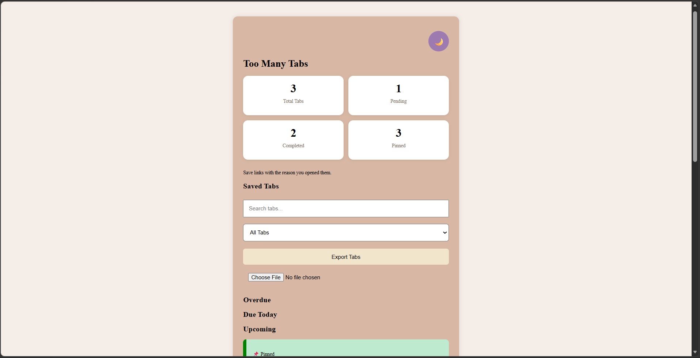
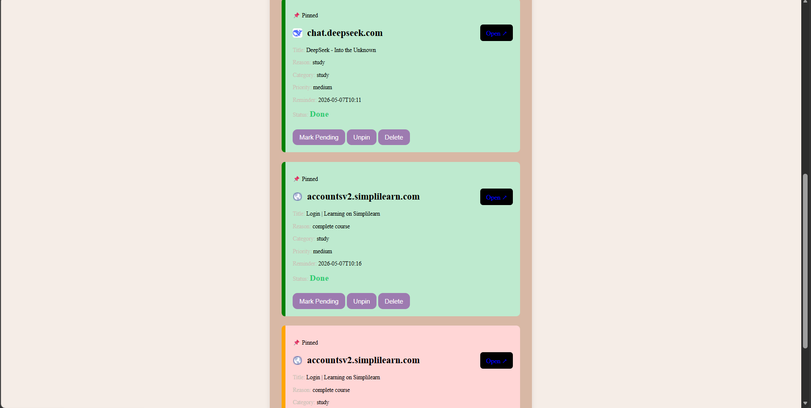
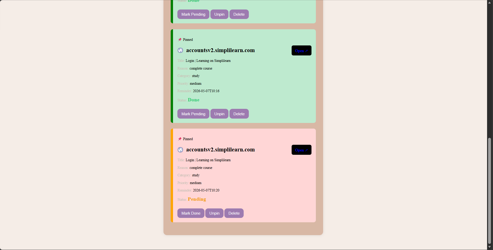
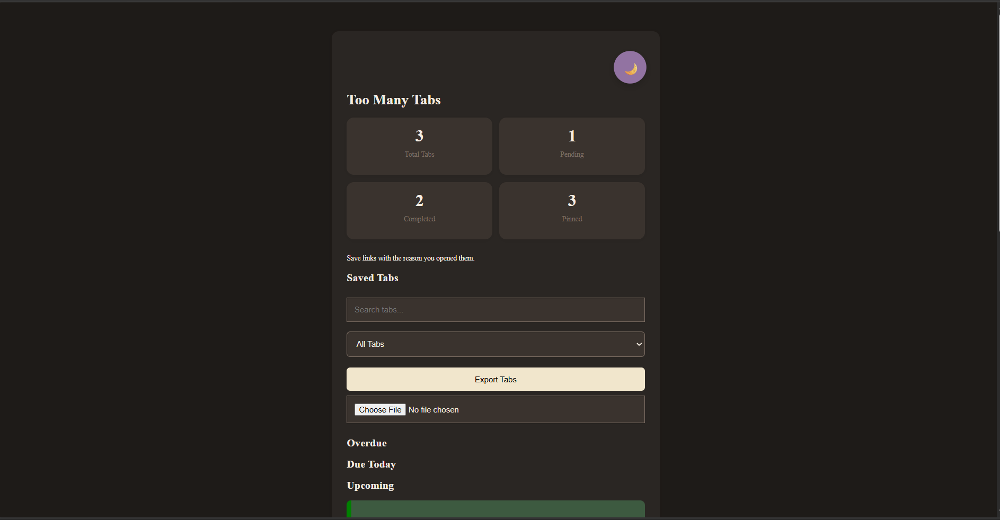
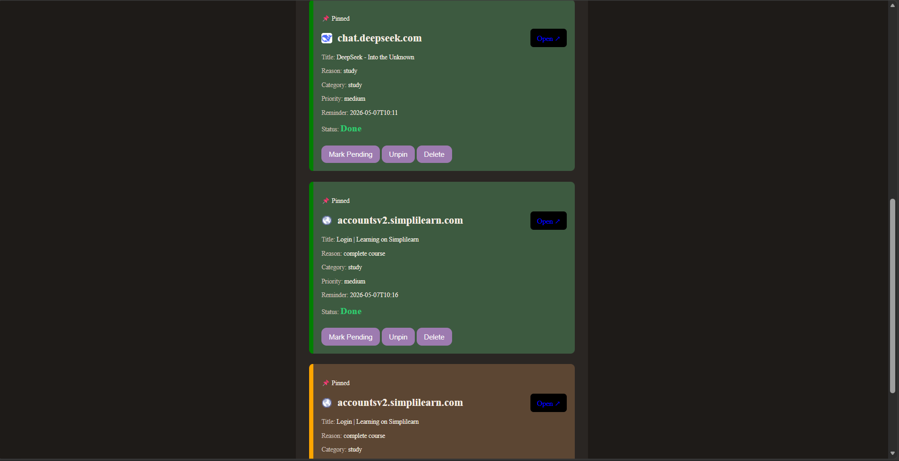
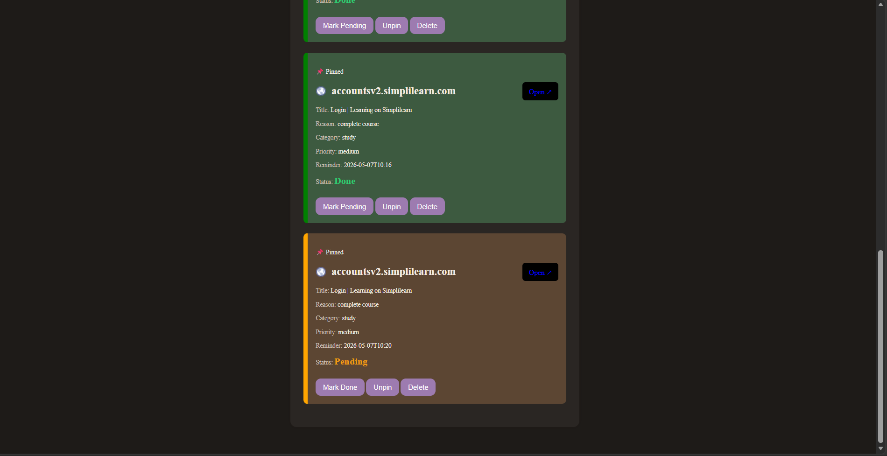
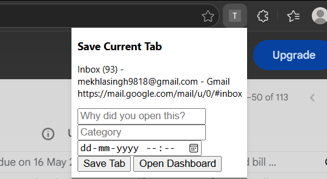

# Too Many Tabs 🧠✨

A productivity tool that helps you remember why you opened a tab, not just the tab itself.

## Features

- Save tabs with reason, category, priority, and reminder
- Browser extension to save the current tab
- Dashboard to view saved tabs
- Mark tabs as Done or Pending
- Pin important tabs
- Search and filter tabs
- Statistics dashboard
- Dark mode
- Browser notifications
- Export and import saved tabs
- Website favicon icons

## Tech Stack

- HTML
- CSS
- JavaScript
- Browser Extension APIs
- LocalStorage
- chrome.storage / Edge extension storage

## How to Run the Web App

1. Open the project in VS Code
2. Open `index.html`
3. Click Go Live using Live Server

## How to Run the Extension

1. Open Microsoft Edge
2. Go to `edge://extensions`
3. Turn on Developer mode
4. Click Load unpacked
5. Select this project folder
6. Pin the extension
7. Open any website and save the current tab

## Why I Built This

People often open many tabs and later forget why they opened them. This app helps users save the reason, reminder, and priority behind each tab so they can return to it with context.

## Future Improvements

- Cloud sync
- AI-based category detection
- Auto webpage summaries
- Cross-device sync

## Screenshots

### Dashboard (Light Mode)

### Dashboard (Dark Mode)

### Extension Popup
